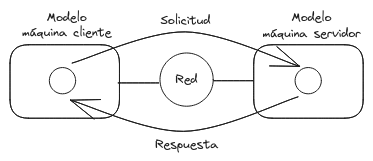
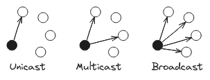
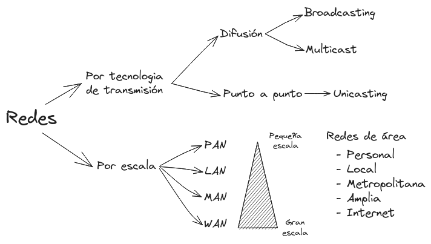

# Redes de computadoras

<!-- toc -->

Un conjunto de computadoras **autónomas** interconectadas

Una red de computadoras es una serie de dispositivos conectados entre si, con la capacidad de comunicarse y compartir recursos a través de medios de transmisión alámbricos e inalámbricos, permitiendo la colaboración entre usuarios y dispositivos en diferentes ubicaciones geográficas.

# Antecedentes 

La solución trivial seria conectar a todos los dispositivos con todos, pero es altamente ineficiente.

 

Una solución es asignar un **conmutador** para descongestionar el trafico.

 

En los inicios de la telefonía el conmutador era una persona que gestionaba las conexiones a mano.

Posteriormente se comenzó a usar un numero de teléfono para que un conmutador electrónico llamado *central* supiera con que lineas realizar la conexión.

También las centrales que se encuentren en dos zonas diferentes se pueden comunicar entre si.

 

<!-- #AudreFlooded111 -->

# Interoperatibilidad

Es la capacidad de las plataformas digitales de intercambiar información de manera uniforme y eficiente usando protocolos comunes de comunicación.

> Nota
> 
> - Internet es una red de redes
> - Web es un sistema distribuido que se ejecuta sobre Internet
> - Ni internet ni web son una red de computadoras

# Aplicaciones

## Modelo Cliente Servidor

 

<!-- #BrenkSucks7 -->

## Clasificación de redes

- Por tecnología de transmisión
    - Difusión
        - Broadcasting: Cualquiera tiene acceso
        - Multicast: "Un curso privado con acceso de paga"
    - Punto a Punto
        - Unicasting: "Un torrent"

 

- Por escala
    - PAN: Personal Area Network, cercano al punto de acceso
    - LAN: Local Area Network, situado en el mismo edificio o área cercana
    - MAN: Metropolitan Area Network, cobertura a una área extensa
    - WAN: Wide Area Network, cubre grandes áreas geográficas

 

<!-- #BrenkSucks7 -->

<!-- #pendiente comandos `traceroute` y `tracert` -->

<!-- #Practica -->
<!---->
<!-- `ipconfig` es equivalente a `ip addr` -->
<!-- flags de ping, tracert -->
